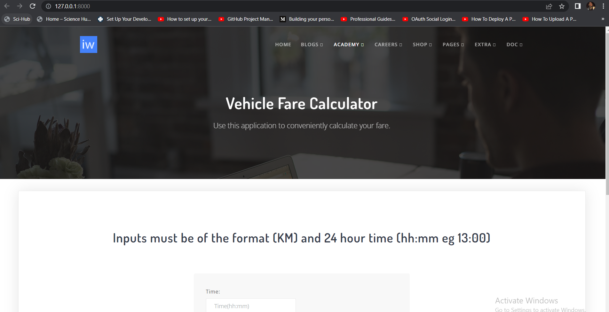

# Django_application

## Setting up the project
1-Clone the repo \
2-Change directory \
`cd Django_application`\
3-Create a virtualenv\
`virtualenv env`\
-OR
-Download python 3.8.2 and Create a virtualenv with it \
`py -m virtualenv -p=<your_python_executable> <virtual_environment_directory>`\
`for eg,virtualenv -p C:\Users\lenovo\AppData\Local\Programs\Python\Python37\python.exe env`\
4-Activate your environtment\
`env\Sripts\activate` 

5-Install dependencies\
`pip install -requirements.txt`\

6-Import the insight.sql in Pgadmin(preferably)\
***Note,Use Postgres

7-Navigate to the path project_insight\settings\
-Create a .env file (take refrence from .env.sample.txt)\
-Inside .env\
`password="your DB password"`\
-In local.py change Name and USER if required

8-Make migrations navigate to Django_application and \
`python manage.py makemigrations --settings project_insight.settings.local`\
`python manage.py migrate --settings project_insight.settings.local`

9-Run server\
`python manage.py runserver --settings project_insight.settings.local`

## snippets of app

9-Run tests(optional)\
`python manage.py tests apps.main`

